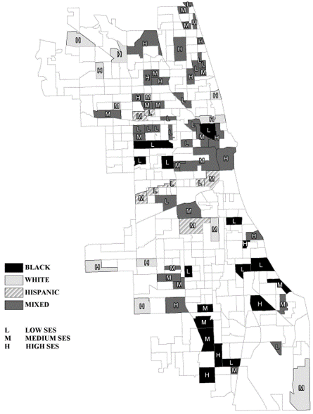
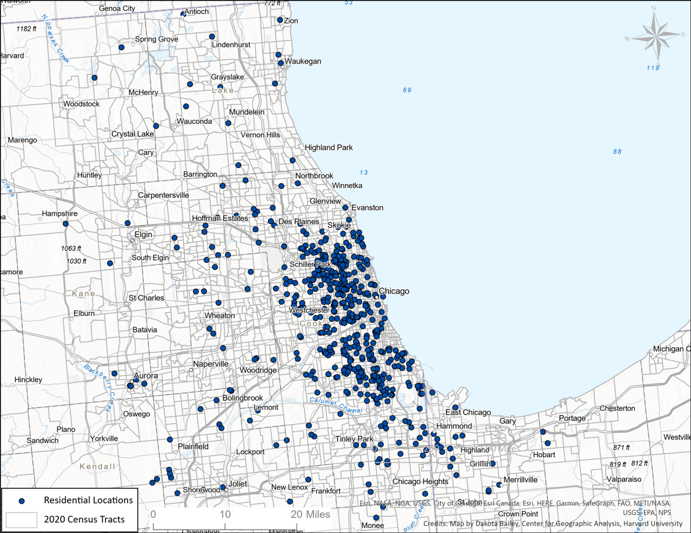
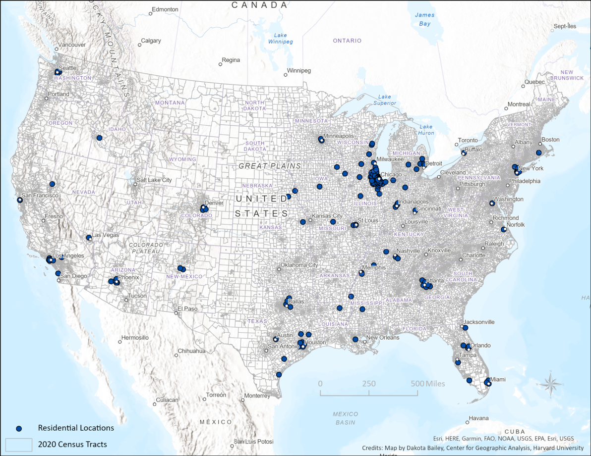

---
output:
  powerpoint_presentation:
    reference_doc: ref/phdcn_template.pptx
    incremental: true
---

```{r setup}
#| include: false
library(tidyverse)
library(ggforce)
library(ggtext)
library(showtext)
library(marginaleffects)
load("./data/survival_data.RData")
load("../../../Kirk Projects/phdcn_gun_violence_exposures/data/output/npt_cohort_models.RData")
load("../../../Kirk Projects/phdcn_gun_violence_exposures/data/output/npt_race_models.RData")
load("../../../Kirk Projects/phdcn_gun_violence_exposures/data/output/npt_sex_models.RData")
load("../../../Kirk Projects/phdcn_gun_violence_exposures/data/output/spt_base_models.RData")
source("../../../Kirk Projects/phdcn_gun_violence_exposures/syntax/project_functions.R")
knitr::opts_chunk$set(dev = "ragg_png",  
                      dev.args = list(bg = 'transparent'),
                      message = FALSE,
                      echo = FALSE,
                      warning = FALSE,
                      fig.showtext = TRUE,
                      fig.retina = 3)
plot_font <- "Open Sans"
plot_title_font <- "Montserrat"
get_age_percents <- function(x, .race = NULL, .cohort = NULL){
  if(is.null(.race) & is.null(.cohort)){
    exposure_ecdf <- ecdf(x$age_right)
    return(exposure_ecdf(1:40))
  } else if (is.character(.race)){
    exposure_ecdf <- ecdf(x$age_right[x$race == .race])
    return(exposure_ecdf(1:40))
  } else if (is.character(.cohort)){
    exposure_ecdf <- ecdf(x$age_right[x$cohort == .cohort])
    return(exposure_ecdf(1:40))
  } else {
    stop("If provided, race or cohort must be a character value")
  }
}
gg_color_hue <- function(n) {
  hues = seq(15, 375, length = n + 1)
  hcl(h = hues, l = 65, c = 100)[1:n]
}
```

```{r}
#| include: false
#| cache: false

font_add_google(name = plot_font)
font_add_google(name = plot_title_font)
```

# Cohort Differences in Gun Use and Exposure to Gun Violence in a 25-year Study of Chicago Children {background-image="img/dark/50/stephan-cassara-KnAIsBuitGg-unsplash.jpg" background-opacity="0.3"}

&nbsp;

&nbsp;

&nbsp;

&nbsp;

Charles C. Lanfear

Robert J. Sampson

David S. Kirk

Rebecca Bucci
  
---

```{r}
#| fig.width: 9
#| fig.height: 6
load("../../../Kirk Projects/phdcn_neighborhoods/crime/data/derived/hom_rate_df.RData")
hom_rate_df %>%
  select(year, gun_hom_rate, hom_rate) %>%
  pivot_longer(-year) %>%
  mutate(name = ifelse(str_detect(name, "gun"), "Gun\nHomicide", "All\nHomicide")) %>%
  filter(!is.na(value)) %>%
  ggplot(aes(x = year, y = value, group = name, color = name)) + 
  geom_line(size = 1) +
  labs(x = NULL, y = "Homicides per 100,000") +
  scale_y_continuous(limits = c(0, NA)) +
  geom_text(data = tibble(name = c("Gun\nHomicide", "All\nHomicide"),
                          year = c(1985, 1985),
                          value = c(10, 31)),
            aes(label = name),
            size = 6, family = plot_font) +
  theme_minimal(base_size = 24) +
  theme(panel.grid.major.x = element_blank(),
        panel.grid.minor.x = element_blank(),
        panel.grid.minor.y = element_blank(),
        panel.grid.major.y = element_blank(),
        axis.text.x = element_text(color = "grey90"),
        axis.text.y = element_text(color = "grey90"),
        axis.title.y = element_text(color = "grey90"),
        axis.ticks.y = element_line(color = "grey90"), 
        text = element_text(family = plot_font,  color = "white"),
        panel.background = element_rect(fill = "transparent",colour = NA),
        plot.background = element_rect(fill = "transparent",colour = NA),
        legend.position = "none")
```


::: notes
Enormous variation in homicide; early 1990s peak was double the period 2005-2015

Resurgence since 2017

Even during low periods, this is ten or more times the homicide rate of major European cities
:::


# Questions {background-image="img/dark/70/stephan-cassara-KnAIsBuitGg-unsplash.jpg" background-opacity="0.1"}

&nbsp;

&nbsp;

&nbsp;

To what extent do historical conditions and macro-social change influence the likelihood of individuals...

* **using guns**?

* being exposed to **gun violence**?

::: notes
We'll be focusing mostly on cohort here; last session focused on race and sex.
:::

# {background-image="img/dark/50/max-bender-yb7Yg3Rv7WA-unsplash.jpg" background-opacity="0.3"}


# PHDCN (1995-2002) {background-image="img/dark/70/max-bender-yb7Yg3Rv7WA-unsplash.jpg" background-opacity="0.1"}

&nbsp;

&nbsp;

&nbsp;

* Longitudinal study of 6,200 children
   - 7 cohorts in 1995: 0 (infant), 3, 6, 9, 12, 15, and 18

* Probability samples from 80 neighbourhoods
   - Stratified by race and social class

* Three waves, 1995-2002
   - Parents/caretaker and child assessments
   - 75-78% response rates

* Community surveys of 343 neighborhoods
   - 1995 and 2002-2003

# PHDCN+ Wave 4 (2011-2012) {background-image="img/dark/70/max-bender-yb7Yg3Rv7WA-unsplash.jpg" background-opacity="0.1"}

&nbsp;

&nbsp;

&nbsp;

* N = 1,057, nationwide field effort (funded by MacArthur Foundation)

* Random sample of cohorts 0, 9, 12, and 15

* 63% response rate

* Diverse sample: 
   - 40% Latino/Hispanic
   - 37% Black
   - 19% White

# PHDCN+ Wave 5 (May-Oct 2021) {background-image="img/dark/70/max-bender-yb7Yg3Rv7WA-unsplash.jpg" background-opacity="0.1"}

&nbsp;

&nbsp;

&nbsp;

* N =  682, multi-mode survey: web, phone, F2F

* 66% response rate

* Official criminal justice histories, 1995-2020 
   - Planned through 2023

---

```{r}
#| fig.width: 9
#| fig.height: 6
df <- tribble(
  ~cohort, ~time, ~year, ~age, 
  0,  1, 1995,  0,
  0,  2, 2021, 25,
  3,  1, 1995,  3,
  3,  2, 2002, 11,
  6,  1, 1995,  6,
  6,  2, 2002, 14,
  9,  1, 1995, 9, 
  9,  2, 2021, 34,
  12, 1, 1995, 12,
  12, 2, 2021, 37,
  15, 1, 1995, 15,
  15, 2, 2021, 40,
  18, 1, 1995, 18,
  18, 2, 2002, 26,
) %>%
  mutate(focus = ifelse(cohort %in% c(0,9,12,15), "yes", "no"))

cs_df <- tibble(
  survey = rep(c("PHDCN-CS", "CCAHS"), each = 7),
  year   = rep(c(1995, 2002), each = 7),
  cohort = rep(seq(0,18, by = 3), length.out = 14)
)
wave_df <- tibble(
  survey = rep(1:5, length.out = 35),
  year   = rep(c(1995, 1998.5, 2002, 2012, 2021), length.out = 35),
  cohort = rep(seq(0,18, by = 3), each = 5)
) %>%
  filter(year <= 2002 | cohort %in% c(0, 9, 15)) %>%
  mutate(group = 
           case_when(
            year <= 2002 ~ year, 
            year > 2002 & cohort %in% c(9,15,18) ~ year,
            year > 2002 & cohort == 0 ~ year -1),
         phdcn = ifelse(year <= 2002, "PHDCN", "PHDCN+"))


ggplot(df, aes(x = year, y = cohort, group = cohort)) + 
   # geom_mark_rect(data = cs_df, aes(group = year), fill = "#00BFC4", color = NA, expand = unit(7, "mm"), ) +
    geom_mark_rect(data = wave_df, aes(group = group, fill = phdcn), color = NA, expand = unit(6, "mm")) +
  geom_line(size = 3, aes(color = focus)) +
  geom_richtext(aes(label = age, fill = focus), 
                size = 5, label.colour = NA, text.color = "black") +
  theme_minimal(base_size = 24) +
  scale_fill_manual(values = c("yes" = "white", "no" = "grey50", "PHDCN" = "#F8766D", "PHDCN+" = "#00BFC4")) +
  scale_color_manual(values = c("yes" = "white", "no" = "grey50", "PHDCN" = "#F8766D", "PHDCN+" = "#00BFC4")) +
  labs(y = "Cohort Ages", x= NULL, title = "Timeline") +
  scale_x_continuous(breaks = seq(1995, 2021, by = 5), limits = c(1994,2022)) +
  scale_y_continuous(limits = c(-1,22)) +
  
  annotate("text", x = 1998.5, y = 21.25, family = plot_font, label = "Original PHDCN\nWaves 1–3", color = "#F8766D", size = 5) +
  annotate("text", x = 2016.5, y = 21.25, family = plot_font, label = "PHDCN+\nWaves 4 & 5", color = "#00BFC4", size = 5) +
  theme(panel.grid = element_blank(),
        axis.text.y = element_blank(),
        axis.text.x = element_text(color = "grey90"),
        text = element_text(family = plot_font,  color = "white"),
        plot.title = element_text(family = plot_title_font,  color = "white", size = rel(1.5), face = "bold"),
        panel.background = element_rect(fill = "transparent",colour = NA),
        plot.background = element_rect(fill = "transparent",colour = NA),
        legend.position = "none")
```

::: notes
PHDCN+ covers much longer time period than original PHDCN: Age 0 to 40, 25 years within each cohort

Well past peak criminal involvement and exposure ages
:::

---

:::: {.columns}

::: {.column width="40%"}

:::

::: {.column width="60%"}

:::

::::

---

:::: {.columns}

::: {.column width="40%"}

:::

::: {.column width="60%"}

:::

::::


---

```{r}
#| fig.width: 9
#| fig.height: 6
il_incarceration <- readxl::read_excel("./data/il_incarceration.xlsx", skip = 1) %>%
  pivot_longer(-State) %>%
  transmute(year = as.numeric(name), incarcerated = value)
load("./data/cohort_age_hom.RData")
axis_data <- tibble(cohort = factor(c(0, 9, 12, 15), levels = c(0, 9, 12, 15)),
                          hom_rate = rep(24.8,4),
                          age = rep(-3, 4))

cohort_df <- cohort_age_hom %>%
  left_join(hom_rate_df %>% select(year, gun_hom_rate, disadvantage_spline)) %>%
  left_join(il_incarceration) %>%
  mutate(cohort = str_remove(cohort, "Cohort "),
         cohort = fct_reorder(cohort, as.numeric(cohort)),
         cohort = fct_rev(cohort)) %>%
  select(cohort, year, age, 
         `Gun Homicide` = gun_hom_rate, 
         `Disadvantage` = disadvantage_spline, 
         `Incarceration` = incarcerated) %>%
  pivot_longer(-c(cohort, year, age), 
               names_to = "measure", values_to = "value")

cohort_plot <- function(x){
  out_plot <- cohort_df %>%
    filter(cohort == x) %>%
    ggplot(aes(x = age, y = value, color = measure)) + 
    geom_line() + 
    facet_wrap(~measure, strip.position = "top", ncol = 2, scales = "free_y") +  
    annotate("rect", xmin = 13, xmax = 25, ymin = -Inf, ymax = Inf, fill = "white", alpha = 0.3) +
    theme_minimal(base_size = 20) +
    coord_cartesian(clip = FALSE, xlim = c(0,40)) +
    labs(x = "Age", y = NULL, title = str_c("Cohort ", x, " Context")) +
    theme(panel.grid = element_blank(),
          axis.text = element_text(color = "white"),
          # axis.text.y.right =  element_blank(),
          axis.text.y.left  = element_blank(),
          strip.text = element_text(color =  "white"),
          legend.position = "none",
          text = element_text(family = plot_font,  color = "white"),
          plot.title = element_text(family = plot_title_font,  color = "white", size = rel(1.2), face = "bold"),
          panel.background = element_rect(fill = "transparent",colour = NA),
          plot.background = element_rect(fill = "transparent",colour = NA))
  return(out_plot)
}
cohort_plot("15")

```

::: notes
Align by age instead of year---see age-specific contexts for gun violence, incarceration, disadvantage.

Age 13 to 25 highlighted as peak risk period---different patterns for all cohorts
:::

---

```{r}
#| fig.width: 9
#| fig.height: 6
cohort_plot("12")
```

---

```{r}
#| fig.width: 9
#| fig.height: 6
cohort_plot("9")
```

---

```{r}
#| fig.width: 9
#| fig.height: 6
cohort_plot("0")
```

# Lifecourse Gun Use and Exposures to Gun Violence {background-image="img/dark/50/ozzie-stern-dkwJLowVvl4-unsplash.jpg" background-opacity="0.3"}

---

# Measures {background-image="img/dark/70/ozzie-stern-dkwJLowVvl4-unsplash.jpg" background-opacity="0.1"}

&nbsp;

&nbsp;

&nbsp;

Has the respondent...

- ever been shot?
- ever seen someone else get shot?
- ever carried a concealed gun?
- ever used a gun for protection?

---

```{r}
#| fig.width: 9
#| fig.height: 6

get_age_percents <- function(x, .race = NULL, .cohort = NULL){
  if(is.null(.race) & is.null(.cohort)){
    exposure_ecdf <- ecdf(x$age_right)
    return(exposure_ecdf(1:42))
  } else if (is.character(.race)){
    exposure_ecdf <- ecdf(x$age_right[x$race == .race])
    return(exposure_ecdf(1:42))
  } else if (is.character(.cohort)){
    exposure_ecdf <- ecdf(x$age_right[x$cohort == .cohort])
    age_index <- c("0" = 27, "9" = 36, "12" = 39, "15" = 42)[as.character(.cohort)]
    index <- 1:age_index
    return(exposure_ecdf(index))
  } else {
    stop("If provided, race or cohort must be a character value")
  }
}
survival_data %>%
  map_df(get_age_percents) %>%
  mutate(age = row_number()) %>%
  pivot_longer(-age) %>%
  mutate(name = str_to_title(str_replace(name, "_", " ")),
         name = fct_relevel(name, "Seen Shot", "Concealed Carry", "Used Gun", "Been Shot")) %>%
  ggplot(aes(x = age, y = value, group = name, color = name)) + 
  geom_line() + 
  geom_richtext(data = ~ . |> group_by(name) |> slice_max(age), aes(label = name), fill = "black" ) +
  theme_minimal(base_size = 24) + 
  scale_x_continuous(breaks = seq(0, 40, by = 10)) +
  scale_y_continuous(breaks = scales::breaks_pretty(n=3)) +
  coord_cartesian(clip = "off", xlim = c(0, 45)) +
  labs(x = "Age", y = "Proportion", color = "Outcome", title = "Gun Use and Exposure") +
  theme( panel.grid = element_blank(),
          axis.text = element_text(family = plot_font,  color = "white"),
          # axis.text.y.right =  element_blank(),
          # axis.text.y.left  = element_blank(),
          # strip.text.y.left = element_text(color =  "transparent", angle = 0),
          legend.position = "none",
          text = element_text(family = plot_font,  color = "white"),
          plot.title = element_text(family = plot_title_font,  color = "white", size = rel(1.2), face = "bold"),
          panel.background = element_rect(fill = "transparent",colour = NA),
          plot.background = element_rect(fill = "transparent",colour = NA))
```

---

```{r}
#| fig.width: 9
#| fig.height: 6
cohort_vec <- as.character(c(0,9,12,15))
names(cohort_vec) <- cohort_vec
map_dfr(cohort_vec, 
        ~map2_dfr(.x = survival_data, .y = .x, ~get_age_percents(.x, .cohort = .y)) %>%
         mutate(age = row_number()), .id = "cohort") %>%
  pivot_longer(-c(cohort,age)) %>%
  mutate(name = str_to_title(str_replace(name, "_", " ")),
         name = fct_relevel(name, "Seen Shot", "Concealed Carry", "Used Gun", "Been Shot"),
         cohort = factor(cohort, levels = rev(c(0,9,12,15)))) %>%
  ggplot(aes(x = age, y = value, group = cohort, color = cohort)) + 
  facet_wrap(~name, scales = "free_y") +
  geom_line() + 
  geom_richtext(data = ~ . |> group_by(cohort) |> slice_max(age), aes(label = cohort), fill = "black" ) +
  scale_x_continuous(breaks = seq(0, 40, by = 10)) +
  scale_y_continuous(breaks = scales::breaks_pretty(n=3)) +
  coord_cartesian(clip = "off", xlim = c(0, 45)) +
  theme_minimal(base_size = 24) + 
  labs(x = "Age", y = "Proportion", color = "Cohort", title = "Cohort Differences")  + 
  theme( panel.grid = element_blank(),
           axis.text = element_text(family = plot_font,  color = "white"),
          # axis.text.y.right =  element_blank(),
          # axis.text.y.left  = element_blank(),
          strip.text = element_text(family = plot_font, color =  "white"),
          legend.position = "none",
          text = element_text(family = plot_font,  color = "white"),
          plot.title = element_text(family = plot_title_font,  color = "white", size = rel(1.2), face = "bold"),
          panel.background = element_rect(fill = "transparent",colour = NA),
          plot.background = element_rect(fill = "transparent",colour = NA))
```

---

```{r}
#| fig.width: 9
#| fig.height: 6
logit_models <- list(
`Seen Shot` = glm(formula = factor(seen_shot_ever) ~ cohort + sex + race + 
    PCA_disadv_09 + hom_rate_avg_09 + collective_efficacy_09 + pcimgen, family = binomial, data = survival_data[["seen_shot"]] %>% filter(w5_sample)),
`Been Shot` = glm(formula = factor(been_shot_ever) ~ cohort + sex + race + 
    PCA_disadv_09 + hom_rate_avg_09 + collective_efficacy_09 + pcimgen, family = binomial, data = survival_data[["been_shot"]] %>% filter(w5_sample)),
`Concealed Carry` = glm(formula = factor(concealed_carry_ever) ~ cohort + sex + race + 
    PCA_disadv_09 + hom_rate_avg_09 + collective_efficacy_09 + pcimgen, family = binomial, data = survival_data[["concealed_carry"]] %>% filter(w5_sample)),
`Used Gun` = glm(formula = factor(used_gun_ever) ~ cohort + sex + race + 
    PCA_disadv_09 + hom_rate_avg_09 + collective_efficacy_09 + pcimgen, family = binomial, data = survival_data[["used_gun"]] %>% filter(w5_sample)))

map_dfr(logit_models, ~tidy(marginalmeans(., type = "response")), .id = "outcome") %>%
  filter(term == "cohort") %>%
  ggplot(aes(x = value, y = estimate, fill = value)) + 
  geom_col() + 
  facet_wrap(~outcome, scales = "free_y") +
  labs(x = "Cohort", y = NULL, title = "Model Predictions") +
  scale_y_continuous(breaks = scales::breaks_pretty(n=3)) +
  theme_minimal(base_size = 24) +
  theme(panel.grid = element_blank(),
           axis.text = element_text(family = plot_font,  color = "white"),
          # axis.text.y.right =  element_blank(),
          # axis.text.y.left  = element_blank(),
          strip.background = element_rect(fill = "transparent",colour = NA),
          strip.text = element_text(family = plot_font,  color = "white"),
          legend.position = "none",
          text = element_text(family = plot_font,  color = "white"),
          plot.title = element_text(family = plot_title_font,  color = "white", size = rel(1.2), face = "bold"),
          panel.background = element_rect(fill = "transparent",colour = NA),
          plot.background = element_rect(fill = "transparent",colour = NA))

```


# Future Plans {background-image="img/dark/50/joel-mott-s-rsM-AktbA-unsplash.jpg" background-opacity="0.1"}

&nbsp;

&nbsp;

&nbsp;

* Period effects, social change, and exposure to violence

* Life course of victimization through mid-adulthood

* Reproduction of gun violence

* Long-term causal consequences of exposure to violence for health and well-being

* The extent and consequences of exposure to police brutality

* Residential attainment in levels of gun violence in 2021

#  Feedback and Questions {background-image="img/dark/70/max-bender-yb7Yg3Rv7WA-unsplash.jpg" background-opacity="0.3"}

&nbsp;

&nbsp;

&nbsp;

**Contact:**

| Charles C. Lanfear
| Institute of Criminology
| University of Cambridge

**See more about the PHDCN:**

https://sites.harvard.edu/phdcn/


# References {background-image="img/dark/70/ben-sp-fD4AwrWv4t8-unsplash-crop.jpg" background-opacity="0.3"}

&nbsp;

&nbsp;

&nbsp;

Sampson, Kirk, & Bucci. 2022. "Cohort Profile: Project on Human Development in Chicago Neighborhoods and Its Additions (PHDCN+)." *Journal of Developmental and Life-Course Criminology* 8.
